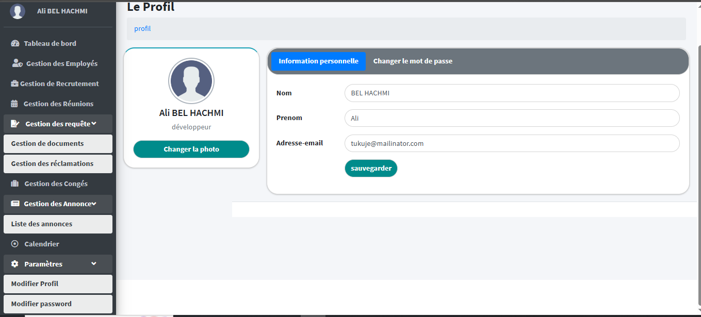
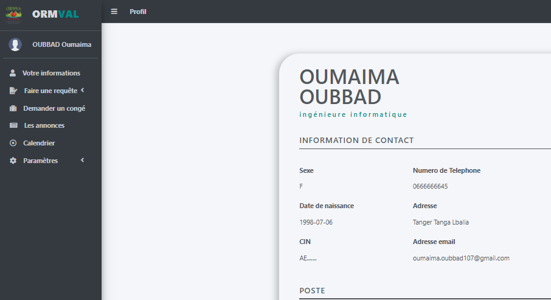

# 💼 Application Web de Gestion des Ressources Humaines

Cette application Laravel permet de gérer efficacement les ressources humaines dans une entreprise, avec trois types d'utilisateurs : **Responsable RH**, **Employé**, et **Candidat**. Elle offre un système complet de gestion du personnel, de congés, de recrutements, de réunions et bien plus.

---

## 👥 Acteurs de l'application

| Acteur          | Description |
|------------------|-------------|
| **Responsable RH** | Accès complet à toutes les fonctionnalités de gestion (employés, réunions, recrutements, congés, etc.) |
| **Employé**        | Accès à ses propres données, gestion de profil, demandes de congés, pointage, etc. |
| **Candidat**       | Consultation des annonces d'emploi et soumission de candidatures |

---
### Interface Admin

### Interface Employé

## 📌 Fonctionnalités

### ✅ Fonctionnalités pour le Responsable RH :
- Authentification / Déconnexion
- Gestion des employés et des rôles
- Gestion de son profil
- Gestion des recrutements
- Gestion des congés
- Gestion des attestations et réclamations
- Gestion du pointage
- Gestion des annonces
- Gestion des réunions

### 👤 Fonctionnalités pour l'Employé :
- Authentification / Déconnexion
- Consultation et exportation de ses informations personnelles
- Gestion de son profil
- Pointage
- Demande de congé
- Demande d'attestation ou réclamation
- Accès aux annonces internes

### 🎯 Fonctionnalités pour le Candidat :
- Consultation des annonces de recrutement
- Postuler à des offres d'emploi via un formulaire

---

## 🔒 Authentification

- Authentification via email et mot de passe
- **Mot de passe par défaut** : admi

---

## 🔧 Technologies utilisées

- Laravel (PHP)
- Blade (moteur de template)
- Bootstrap / CSS
- JavaScript / jQuery
- MySQL
- DataTables
- Chart.js
- FullCalendar

---

## 📷 Captures d’écran

### 🔐 Page de connexion

### 📄 Gestion des employés

### 📆 Gestion des congés

### 📑 Réclamations 

## 📂 Dossier des captures d'écran

Toutes les captures d’écran utilisées dans ce projet sont disponibles dans le dossier [`/screenshots`](screenshots/).
